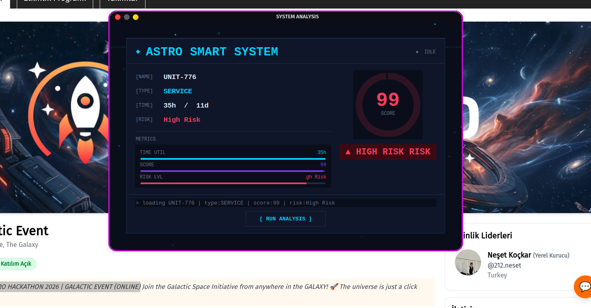
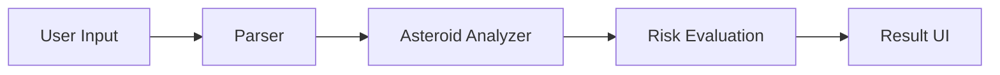

# 🚀 Asteroid Collision Detector

### Smart Risk Analysis for Space Safety 🌌


---

## 👥 Team

- 👩‍💻 Fatima Zahrae  
- 👩‍💻 Hiba  
- 👨‍💻 Noamane  

---

## 🧠 Overview

**Asteroid Collision Detector** is a smart system designed to analyze asteroid data and evaluate the potential risk of collision with Earth or space infrastructure.

The system transforms **raw asteroid data** into a **clear, fast, and actionable risk level**.

---

## 🎯 Problem

Modern space systems are increasingly vulnerable to asteroid threats:

* 🛰️ Potential damage to satellites
* 🚀 Risks to space stations
* ⚠️ Need for fast and accurate decision-making

👉 Raw data alone is difficult to interpret quickly.

---

## 💡 Solution

Our system provides:

* 📊 Asteroid data analysis
* ⏱️ Time-to-impact calculation
* 🧠 Multi-factor risk evaluation

👉 Final output: **Clear Risk Level (Low / Medium / High)**

---

## ⚙️ How It Works



### 🔄 Workflow

1. User enters asteroid data via terminal (CLI)
2. Parser validates the input
3. Analyzer computes:

   * Time to impact
   * Diameter impact
   * Material type
4. System generates a **risk score**
5. Result is displayed via Tkinter UI

---

## 🧠 Core Algorithm

The risk model is based on three main factors:

| Factor      | Purpose                   |
| ----------- | ------------------------- |
| ⏱ Time      | Measures urgency          |
| 📐 Diameter | Determines impact size    |
| 🪨 Type     | Evaluates material danger |

👉 Each factor contributes to a **total risk score**

---

## 🚨 Risk Classification

| Score | Risk Level     |
| ----- | -------------- |
| ≥ 8   | 🚨 High Risk   |
| ≥ 5   | ⚠️ Medium Risk |
| < 5   | ✅ Low Risk     |

---

## 🧪 Example

**Input:**

```json id="g4l8b1"
{
  "distance": 0.5,
  "speed": 20,
  "diameter": 3.2,
  "type": "M-type"
}
```

**Output:**

```id="v0y7qk"
Time: ~10 hours
Risk: 🚨 High Risk
```

---

## 🧱 System Architecture

```text id="4kz9xa"
project/
│
├── main.py                # Entry point (CLI + GUI)
├── parser.py             # Input handling & validation
├── AsteroidAnalyzer.py   # Core logic & calculations
├── result_ui.py          # Tkinter UI (result display)
```

👉 Modular design ensures scalability and maintainability

---

## 🛠️ Technologies

* 🐍 Python
* 🧱 Object-Oriented Programming (OOP)
* 🎨 Tkinter (GUI)
* 📊 Scientific calculations

---

## ✨ Features

* ✅ Accurate time calculation (hours & days)
* ✅ Multi-factor risk analysis
* ✅ Animated UI (typing effect)
* ✅ Dynamic color feedback based on risk level
* ✅ Clean and modular architecture

---

## 🚀 Future Improvements

* 🌐 Integration with real-time APIs (e.g., NASA data)
* 📈 Data visualization (charts & graphs)
* 🤖 AI-based prediction models
* 🖥️ Full GUI input (no terminal required)
* 📄 Export reports (PDF / JSON)

---

## 👥 Team

* Fatima Zahrae : Algorithm
* Hiba Ait Belmoumene : Parsing
* Noamane Elhansali : Output + UI

---

## ▶️ Installation

### Requirements

* Python 3.10+
* Tkinter

### Install Tkinter (Arch / Garuda Linux)

```bash id="n6r8pb"
sudo pacman -S tk
```

---

## ▶️ Run the Project

```bash id="xv2h7n"
python main.py
```

---

## 🎯 Conclusion

This project:

* ⚡ Provides fast asteroid risk evaluation
* 🧠 Simplifies complex data into clear decisions
* 🚀 Is scalable and extensible

---

## 📜 License

This project is open-source and free to use.

---

## 🙌 Acknowledgment

Inspired by real-world challenges in **space safety and asteroid monitoring systems**.
